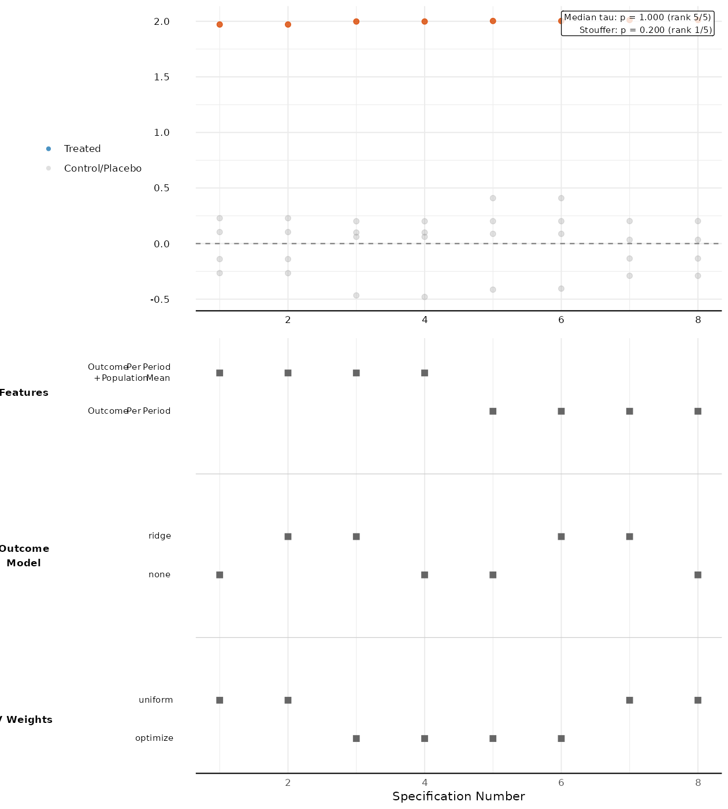

# SCMs: Synthetic Control Workflows for Applied Research

`SCMs` is an R package for running synthetic control analyses with a workflow that is explicit, reproducible, and easy to audit.

It supports:
- standard synthetic control estimation
- placebo-based inference
- specification-curve analysis across many defensible modeling choices
- SHAP summaries to show which choices move estimated effects most

This package is designed for applied users who want policy-facing results without hidden defaults.

## Who This Is For

This README is written for users with the technical background of an applied criminologist:
- comfortable with R data frames
- comfortable running model code
- not looking to debug low-level optimization internals

If that is your use case, start with the two workflows below:
1. Single-run SCM (`scdata()` -> `scest()` -> `inference_sc()`)
2. Robustness over many runs (`spec_curve()` -> `plot_spec_curve()`)

## Install

```bash
# From the package root (repo/SCMs)
R CMD INSTALL --no-multiarch --no-demo --no-docs .
```

For development inside the repo:

```r
library(devtools)
load_all(".")
```

## Data Requirements

Input must be long panel data with one row per `unit x time`:
- one unit ID column
- one time column (numeric/integer/date)
- one numeric outcome column
- optional numeric covariates

You must also define:
- treated unit
- donor pool (control units)
- pre-treatment periods
- post-treatment periods

## Workflow 1: Single SCM Estimate + Placebo Inference

```r
library(SCMs)

set.seed(123)
df <- expand.grid(
  unit = c("treated", "c1", "c2", "c3"),
  year = 2001:2010,
  KEEP.OUT.ATTRS = FALSE,
  stringsAsFactors = FALSE
)

df$outcome <-
  50 + 0.8 * (df$year - 2001) +
  ifelse(df$unit == "treated" & df$year >= 2007, 3, 0) +
  rnorm(nrow(df), 0, 0.5)

df$population <-
  20 + 0.2 * (df$year - 2001) +
  rnorm(nrow(df), 0, 0.3)

scm_data <- scdata(
  df = df,
  id.var = "unit",
  time.var = "year",
  outcome.var = "outcome",
  period.pre = 2001:2006,
  period.post = 2007:2010,
  unit.tr = "treated",
  unit.co = c("c1", "c2", "c3"),
  covagg = list(
    list(var = "outcome_var", partition_periods = list(type = "by_period")),
    list(var = "population", compute = "mean")
  )
)

fit <- scest(
  data = scm_data,
  w.constr = list(name = "simplex"),
  feature_weights = "optimize"
)

summary(fit)
scplot(fit)

est <- estimate_sc(
  dataset = df,
  outcome = "outcome",
  covagg = list(
    list(var = "outcome_var", partition_periods = list(type = "by_period")),
    list(var = "population", compute = "mean")
  ),
  col_name_unit_name = "unit",
  name_treated_unit = "treated",
  col_name_period = "year",
  treated_period = 2007,
  min_period = 2001,
  end_period = 2010,
  outcome_models = "none",
  feature_weights = "optimize",
  w.constr = list(name = "simplex")
)

placebo <- inference_sc(est, dataset = df, verbose = FALSE)
placebo$abadie_significance
```

## Workflow 2: Specification Curve (Robustness Over Many Choices)

Use this when you want to show how sensitive conclusions are across a prespecified set of modeling choices.

```r
library(SCMs)
library(data.table)

set.seed(42)
d <- expand.grid(
  unit = c("treated", "c1", "c2", "c3", "c4"),
  year = 2001:2010,
  KEEP.OUT.ATTRS = FALSE,
  stringsAsFactors = FALSE
)

# Keep IDs alphanumeric for robust internal matching.
d$unit_id <- gsub("[^A-Za-z0-9_]", "_", d$unit)

d$outcome <-
  100 + 0.5 * (d$year - 2001) +
  ifelse(d$unit == "treated" & d$year >= 2007, 2, 0) +
  rnorm(nrow(d), 0, 0.3)

d$population <-
  50 + 0.1 * (d$year - 2001) +
  rnorm(nrow(d), 0, 0.2)

spec_results <- spec_curve(
  dataset = d,
  outcomes = "outcome",
  col_name_unit_name = "unit_id",
  name_treated_unit = "treated",
  covagg = list(
    "Outcome Per Period" = list(
      label = "Outcome Per Period",
      operations = list(
        list(var = "outcome_var", partition_periods = list(type = "by_period"))
      )
    ),
    "Outcome Per Period + Population Mean" = list(
      label = "Outcome Per Period + Population Mean",
      operations = list(
        list(var = "outcome_var", partition_periods = list(type = "by_period")),
        list(var = "population", compute = "mean")
      )
    )
  ),
  treated_period = 2007,
  min_period = 2001,
  end_period = 2010,
  col_name_period = "year",
  feature_weights = c("uniform", "optimize"),
  outcome_models = c("none", "ridge"),
  donor_sample = "all",
  constraints = list(list(name = "simplex")),
  constants = FALSE,
  cores = 1,
  verbose = FALSE,
  inference_type = "placebo"
)

plot_obj <- plot_spec_curve(
  long_data = spec_results,
  name_treated_unit = "treated",
  outcomes = "outcome",
  show_shap = TRUE,
  show_predictions = TRUE,
  show_pvalues = TRUE,
  test_statistic = "treatment_effect"
)

plot_obj$final_plot
```

### Example Specification Curve Plot (Basque Data)



## How to Think About `covagg` (Most Important Input)

`covagg` defines which pre-treatment moments become matching features.

Each operation can specify:
- `var`: variable name, or `"outcome_var"`
- `select_periods`: which pre-period years to include
- `partition_periods`: how selected years are grouped into features
- `compute`: summary function for each group (default is mean)

Common patterns:
- Outcome per-period trajectory:
  - `list(var = "outcome_var", partition_periods = list(type = "by_period"))`
- Covariate pre-period mean:
  - `list(var = "population", compute = "mean")`
- Covariate over custom years only:
  - `list(var = "unemployment", select_periods = list(type = "explicit", periods = 2001:2004), compute = "mean")`

For more details:
- `COVAGG.md`
- `?scdata`
- `?spec_curve`

## Recommended Defaults for Applied Work

If you are starting a real policy application, begin with:
- `w.constr = list(name = "simplex")`
- `feature_weights = "optimize"`
- explicit `covagg` including per-period outcome + a small covariate set
- `inference_type = "placebo"`

Then run a specification curve before writing conclusions.

## Troubleshooting

- `Missing covariate variable` error:
  - A variable named in `covagg` does not exist in your dataset.
- `treated unit not found` error:
  - `name_treated_unit` does not match values in the unit column.
- Unexpectedly unstable estimates:
  - Reduce model complexity, simplify covariates, and inspect pre-treatment fit.

## More Examples

- `inst/examples/quick_start_example.R`
- `inst/examples/basque_terrorism_example.R`
- `inst/examples/german_reunification_example.R`

## License

GPL-3
