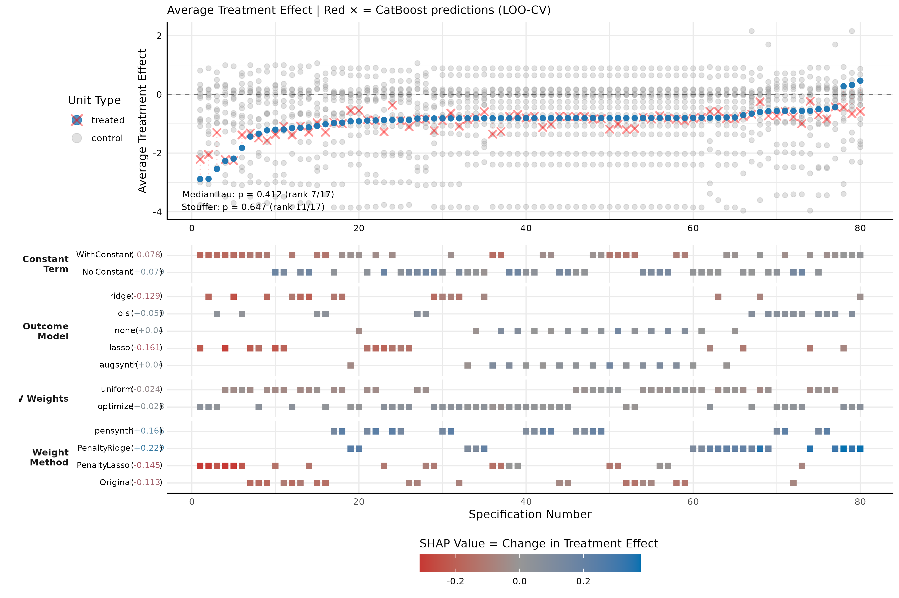

# SCMs: Synthetic Control Methods

A comprehensive R package for Synthetic Control Methods featuring specification curve analysis with SHAP interpretability. The package's highlight is specification curves where each point is colored by its Shapley value, showing how much each specification feature contributes to the predicted treatment effect.

## Installation

```r
# Install from source (ensure you're in the package directory)
devtools::install()
```

## Quick Start

```r
library(SCMs)
library(data.table)

# Load Basque Country dataset
dataset <- fread(system.file("extdata/basque.csv", package = "SCMs"))

# Create SCM data structure
scm_data <- scdata(
  df = dataset,
  id.var = "regionname", time.var = "year", outcome.var = "gdpcap",
  period.pre = 1955:1969, period.post = 1970:1997,
  unit.tr = "Basque Country (Pais Vasco)",
  unit.co = setdiff(unique(dataset$regionname), "Basque Country (Pais Vasco)")
)

# Estimate synthetic control
results <- scest(data = scm_data, w.constr = list(name = "simplex"))

# View results and run inference
summary(results)
plot(results)
inference_results <- inference_sc(results, dataset, inference_type = "placebo")
```

## Covariate Aggregation Guide

The package's flexible covariate system allows sophisticated feature engineering for synthetic control matching. Each specification is a named list with variable name and aggregation method:

### Basic Aggregation Types

```r
covagg = list(
  # Average over all pre-treatment periods (default)
  gdp_mean = list(var = "gdp"),
  
  # Separate feature for each period
  gdp_per_period = list(var = "gdp", each = TRUE),
  
  # Use specific periods only
  gdp_late_pre = list(var = "gdp", periods = c(1985, 1988, 1990)),
  
  # Average over full pre-treatment period (explicit)
  trade_average = list(var = "trade", average = "full_pre")
)
```

### Advanced Aggregation Methods

```r
covagg = list(
  # Rolling N-period averages
  gdp_rolling_3yr = list(var = "gdp", rolling = 3),
  
  # First N periods of pre-treatment
  early_investment = list(var = "investment", first = 5),
  
  # Last N periods before treatment
  late_trade = list(var = "trade", last = 3),
  
  # Every N periods (useful for long time series)
  gdp_every_5yr = list(var = "gdp", every_n = 5),
  
  # Period-over-period growth rates
  gdp_growth = list(var = "gdp", growth = "period_over_period"),
  
  # Volatility measures (standard deviation)
  gdp_volatility = list(var = "gdp", volatility = "sd")
)
```

### Complex Aggregation Examples

```r
# Multiple aggregations for same variable
covagg = list(
  # GDP in different forms
  gdp_early = list(var = "gdp", periods = c(1970, 1975, 1980)),
  gdp_trend = list(var = "gdp", rolling = 5),
  gdp_volatility = list(var = "gdp", volatility = "sd"),
  
  # Trade patterns
  trade_baseline = list(var = "trade", periods = 1970),
  trade_growth = list(var = "trade", growth = "period_over_period"),
  
  # Investment timing
  invest_early = list(var = "investment", first = 10),
  invest_late = list(var = "investment", last = 5),
  
  # Population every 5 years
  pop_milestones = list(var = "population", every_n = 5)
)
```

### Realistic Example: Regional Economic Analysis

```r
# Comprehensive covariate specification for Basque Country analysis
basque_covariates = list(
  # GDP measures
  gdp_baseline = list(var = "gdpcap", periods = c(1960, 1965)),    # Baseline level
  gdp_pre_trend = list(var = "gdpcap", last = 5),                  # Pre-treatment trend
  gdp_each = list(var = "gdpcap", each = TRUE),                    # All periods
  
  # Economic structure (sectoral composition)
  agriculture = list(var = "sec.agriculture", average = "full_pre"), # Agricultural share
  industry = list(var = "sec.industry", average = "full_pre"),       # Industrial share
  energy = list(var = "sec.energy", average = "full_pre"),           # Energy sector
  construction = list(var = "sec.construction", average = "full_pre"), # Construction
  services = list(var = "sec.services.venta", average = "full_pre"),  # Market services
  
  # Demographics and development
  population_density = list(var = "popdens", rolling = 3),         # Population density
  human_capital = list(var = "school.high", periods = c(1964, 1967, 1969)), # Education
  
  # Investment patterns  
  investment_rate = list(var = "invest", first = 10),              # Early investment
  investment_trend = list(var = "invest", rolling = 5)             # Investment momentum
)
```

## Specification Curve Analysis with SHAP

```r
# Run comprehensive specification curve analysis
spec_results <- spec_curve(
  dataset = dataset,
  outcomes = "gdpcap",
  col_name_unit_name = "regionname",
  name_treated_unit = "Basque Country (Pais Vasco)",
  covagg = basque_covariates,  # Use complex covariate specification
  treated_period = 1970,
  min_period = 1955,
  end_period = 1997,
  col_name_period = "year",
  feature_weights = c("uniform", "optimize"),
  outcome_models = c("none", "augsynth", "lasso"),
  constraints = list(
    list(name = "simplex"),
    list(name = "lasso", Q = 0.1),
    list(name = "ridge", Q = 0.1)
  ),
  inference_type = "placebo",
  cores = 4
)

# Configure XGBoost + SHAP analysis
xgboost_config <- create_xgboost_config(
  dataset_name = "basque_terrorism",
  treated_unit_name = "Basque Country (Pais Vasco)",
  outcome_filter = "gdpcap",
  spec_features = c("feat", "outcome_model", "const", "data_sample", "fw")
)

# Generate SHAP values
shap_results <- run_xgboost_shap_analysis(spec_results$results, xgboost_config)

# Create specification curve with SHAP coloring
plot_spec_curve(
  spec_results,
  name_treated_unit = "Basque Country (Pais Vasco)",
  outcomes = "gdpcap",
  shap_values = shap_results$shapley,  # Color by SHAP importance
  test_statistic = "treatment_effect"
)
```

## Performance and Advanced Features

- **High-Performance Computing**: Built-in clarabel solver for faster optimization
- **Parallel Processing**: Handle 1000+ specifications efficiently with multi-core support
- **Comprehensive Inference**: Multiple test statistics (RMSE ratio, treatment effect, normalized)
- **Machine Learning Integration**: XGBoost + SHAP for specification interpretability
- **Flexible Data Processing**: Sophisticated covariate aggregation system

Enable high-performance optimization:
```r
# Use clarabel solver for faster computation
options(SCMs.prefer_clarabel = TRUE)
```

## Data Requirements

Dataset should be in long format with:
- **Unit identifier**: Column for units (countries, states, etc.)
- **Time identifier**: Numeric time periods
- **Outcome variable**: Numeric variable of interest
- **Covariates**: Additional numeric matching variables

```
  country  year   gdp  trade  investment
  Germany  1960  100    50      20
  Germany  1961  105    55      22
  France   1960   95    45      18
  France   1961  100    48      19
```

## Examples and Documentation

- **Quick Start**: `inst/examples/quick_start_example.R`
- **Complete Workflow**: `inst/examples/basque_terrorism_example.R`

### Basque Country Example

The Basque terrorism example replicates and extends Abadie & Gardeazabal (2003), demonstrating how different software implementations can produce contradictory results:

```r
library(SCMs)

# Load Basque Country dataset
dataset <- fread(system.file("extdata/basque.csv", package = "SCMs"))

# Run specification curve analysis
spec_results <- spec_curve(
  dataset = dataset,
  outcomes = "gdpcap",
  name_treated_unit = "Basque Country (Pais Vasco)",
  treated_period = 1970,
  feature_weights = c("uniform", "optimize"),
  outcome_models = c("none", "augsynth", "ridge"),
  covagg = list(
    time_averaged = list(
      gdp_baseline = list(var = "gdpcap", periods = c(1960, 1965)),
      sectors_avg = list(var = "sec.agriculture", average = "full_pre")
    ),
    per_period = list(
      gdp_each = list(var = "gdpcap", each = TRUE),
      sectors_each = list(var = "sec.agriculture", each = TRUE)
    )
  )
)

# Generate SHAP interpretability
shap_results <- run_xgboost_shap_analysis(spec_results$results)

# Create specification curve with SHAP coloring
plot_spec_curve(spec_results, shap_values = shap_results$shapley,
                file_path_save = "basque_spec_curve_analysis.pdf")
```

**Key Finding**: The same conceptual SCM approach produces estimates ranging from large negative to large positive effects, demonstrating the critical importance of specification transparency.



*Basque Country specification curve showing treatment effect estimates across multiple specifications, demonstrating how methodological choices drive variation in results.*

All examples demonstrate the full pipeline from data preparation through specification curve analysis with SHAP interpretability.

<!-- ## Citation

```
Jelveh, Z. (2024). SCMs: Synthetic Control Methods with Advanced Analytics.
R package version 0.1.0.
``` -->

## Contact

Zubin Jelveh - zjelveh@umd.edu

## License

GPL-3
